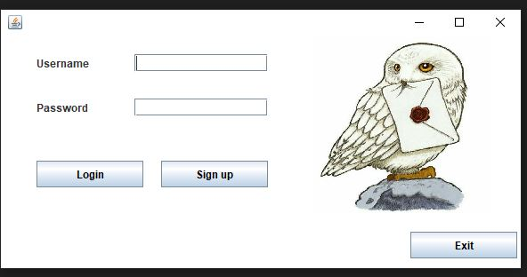
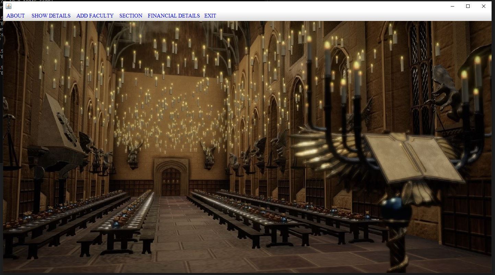
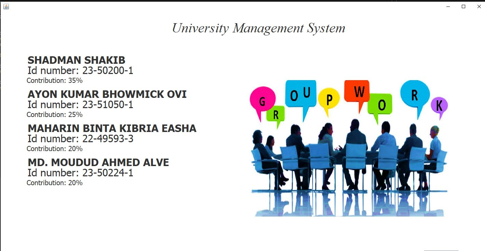

# University Management System

A desktop **University Management System** built in **Java (Swing)** as an Object-Oriented Programming course project. It manages students, teachers, sections, fees and university funds through a GUI, with role-based login and all data stored in text files using **File I/O**.

---

## Features
- **Sign up and login** with credentials stored in files
- **Student registration** and student details view
- **Teacher management**: add and view teacher details
- **Section management**: create and view class sections
- **Fee structure** overview
- **Fund management**: development, utility and teacher-salary funds
- **Dashboards** for admin and students
- **About** page

## OOP concepts used
| Concept | Where it is used |
|---|---|
| Encapsulation | Entity classes (`Fund`, `SectionList`, `Management`, …) with private fields and getters/setters |
| Inheritance | `DevFund`, `UtilityFund` and `TeacherSalFund` extend `Fund` |
| Abstraction and interfaces | `IFund`, `ISection`, `ISectionList` |
| Polymorphism | Different fund types handled through a common type |
| Packages | Code organised into `classes`, `entity` and `interfaces` |
| Exception handling | Around file reading and writing |
| File I/O | Persistent storage of users, students, teachers, sections and funds |

## Project structure
```
University-Management-System/
├── Start.java        # Entry point (main method)
├── classes/          # GUI frames: Welcome, Login, SignUp, DashBoard, StudentDash,
│                     #   REG, Section, SectionFrame, FeeStructure, FundManagement,
│                     #   AddTeacher, ShowStudentDetails, ShowTeacherDetails, About
├── entity/           # Model classes: Fund, DevFund, UtilityFund, TeacherSalFund,
│                     #   SectionList, Management
├── interfaces/       # IFund, ISection, ISectionList
├── File/             # Data files: user_credentials, registration, teachers,
│                     #   Sectionlist, fund
├── icons/            # Images and icons used by the GUI
└── SS/               # Screenshots
```

## Requirements
- **JDK 8 or later**. Check with `java -version` and `javac -version`.

## How to run
Open a terminal **in the project root folder** (the folder that contains `Start.java`):

```bash
javac Start.java classes/*.java entity/*.java interfaces/*.java
java Start
```

## File I/O paths (important)
The app reads and writes its data in the `File/` folder and loads images from `icons/`.
Paths in the code must be **relative to the project root**, not full paths from one computer.

```java
// ❌ Only works on the computer that built it
new File("C:\\Users\\YourName\\Desktop\\OOP project\\File\\fund.txt");
new ImageIcon("C:\\Users\\YourName\\Desktop\\OOP project\\icons\\bird.png");

// ✅ Works on any computer
new File("File/fund.txt");
new ImageIcon("icons/bird.png");
```

- Always start the program **from the project root**. Relative paths are resolved from the folder you run it in.
- Use forward slashes `/`. They work on Windows, macOS and Linux.
- If the app can't find data or images, check these paths first.

## Screenshots
| Welcome | Login |
|---|---|
|  |  |
| **Home** | **About** |
|  |  |

## Tech stack
Java · Swing (GUI) · File I/O

## Team
Final-term project for **CSC 1205 Object Oriented Programming 1** (Section A), American International University-Bangladesh (AIUB).

| Member | Main contributions |
|---|---|
| Shadman Shakib | Login, FeeStructure, ShowStudentDetails & ShowTeacherDetails (File I/O), FundManagement & fund entities, icons & GUI |
| Ayon Kumar Bhowmick Ovi | DashBoard, Section, SectionFrame, SectionsFileIO, SectionList (entity) |
| Maharin Binta Kibria Easha | SignUp, REG, fund-related entities, interfaces, StudentDash |
| Md. Moudud Ahmed Alve | Welcome, REG (frame), ShowStudentDetails & ShowTeacherDetails (frames), AddTeacher, About |

Original team repository: [Shadman-Shakib-Nihan/University_Management_System](https://github.com/Shadman-Shakib-Nihan/University_Management_System)
